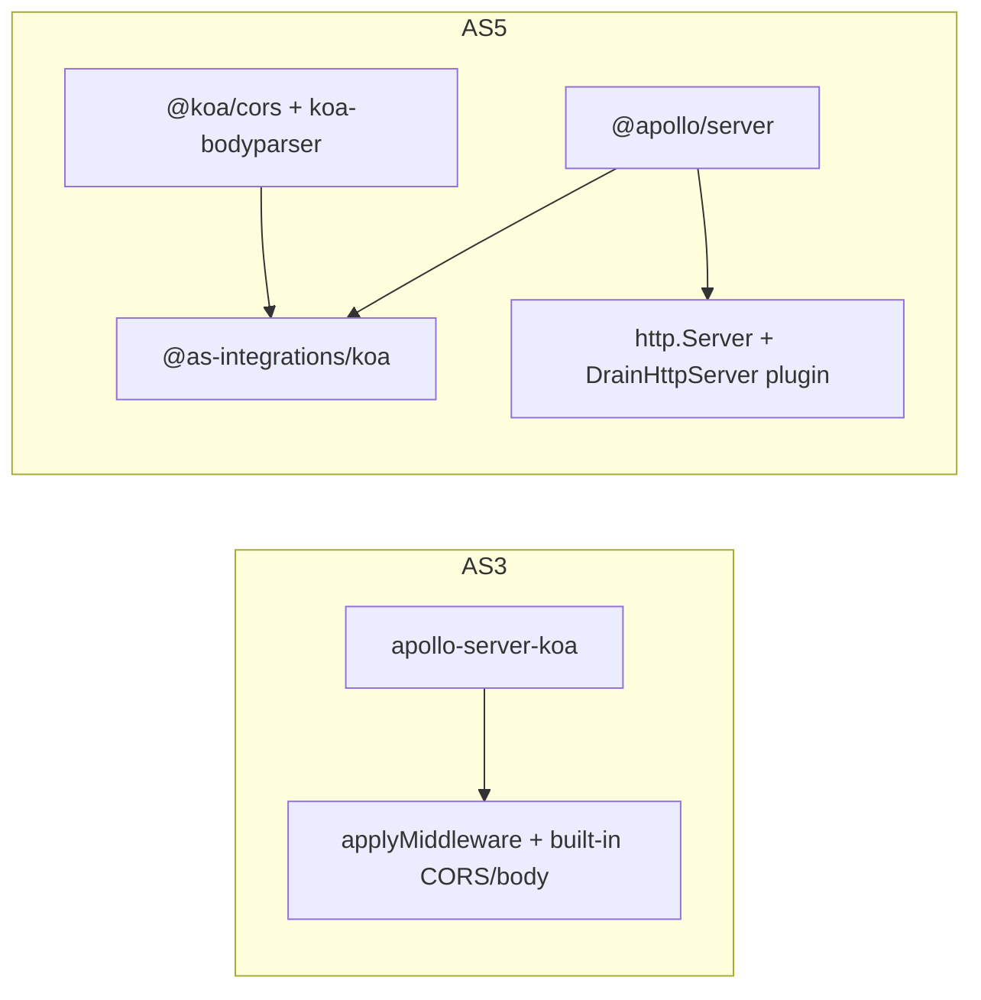

# Migrate to Apollo Server 5 (from v3)

Reference: [Migrating from Apollo Server 3](https://www.apollographql.com/docs/apollo-server/migration-from-v3).

## Current state

- [`package.json`](package.json): `apollo-server-koa@3.10.0`, `apollo-server-core@3.13.0`, `graphql@15.8.0`.
- [`index.js`](index.js): `ApolloServer` from `apollo-server-koa`, `playground` flag, `server.applyMiddleware({ app, cors, path: '/graphql' })`, then `koa-bodyparser` — **new integration requires body parsing before Apollo middleware** (see guide section *HTTP body parsing and CORS*).
- [`graphql/artifactsLoader.js`](graphql/artifactsLoader.js): `gql` from `apollo-server-koa` (AS 4+ does not export `gql`; use [`graphql-tag`](https://www.npmjs.com/package/graphql-tag) default export per guide).

No other files import Apollo packages; resolvers stay as-is (AS still accepts merged resolver maps).

## Dependency changes

| Remove | Add / upgrade |
|--------|----------------|
| `apollo-server-koa`, `apollo-server-core` | `@apollo/server` (v5.x, e.g. latest 5.1.x) |
| — | `@as-integrations/koa` (official Koa integration listed in the guide) |
| `graphql@15` | `graphql@^16.11.0` (required peer of `@apollo/server@5`) |
| — | `graphql-tag` (for `gql` in `artifactsLoader.js`) |
| — | `@koa/cors` (integration README and guide: **you** own CORS in AS 4+) |

Dev: remove [`@types/graphql`](package.json) — `graphql` 16 ships its own types; keeping the old package can conflict.

**Peer dependency caveat:** `@as-integrations/koa@1.1.1` still declares peers `@apollo/server ^4.0.0` and `koa ^2.0.0` on npm, while this repo already uses **Koa 3** ([`koa@3.1.2`](package.json)). Apollo documents this integration for Koa, but there is an open upstream discussion about AS v5 + stale peers ([apollo-server#8170](https://github.com/apollographql/apollo-server/issues/8170)). **Mitigation:** install with npm’s default resolver; if `ERESOLVE` blocks install, use `legacy-peer-deps` (or `overrides`) and rely on a smoke test — same pattern you used for Koa 3 + `apollo-server-koa`.

## Code changes

### 1. [`index.js`](index.js)

Follow the pattern from [`@as-integrations/koa` README](https://www.npmjs.com/package/@as-integrations/koa) (also aligned with the guide’s Express example, but with Koa primitives):

- `const http = require('http')`.
- `const httpServer = http.createServer(app.callback())`.
- `ApolloServer` from `@apollo/server` with `plugins: [ApolloServerPluginDrainHttpServer({ httpServer })]` (import from `@apollo/server/plugin/drainHttpServer`).
- Remove constructor options that no longer exist on AS 5: `playground` (and any `apollo-server-koa`-specific options).
- `await server.start()`.
- Middleware order (critical): `@koa/cors` → `koa-bodyparser` (keep your `jsonLimit` / `enableTypes`) → **GraphQL middleware** → existing `router` middleware.
- Replace `applyMiddleware` with `koaMiddleware` from `@as-integrations/koa`. The integration does not take a `path` option; mount at `/graphql` via **`router.all('/graphql', koaMiddleware(server, { context: ... }))`** (only add `context` if you later need `ctx`-based context; otherwise omit).
- **Listen on `httpServer`**, not `app.listen`, so `ApolloServerPluginDrainHttpServer` matches the real server (same idea as the guide’s Express + `http.createServer` example).

**Behavioral notes from the guide:**

- **Landing page:** Non-production default is embedded **Apollo Sandbox** (not the old GraphQL Playground). Dropping `playground: true` matches current best practice; only add `@apollo/server-plugin-landing-page-graphql-playground` if you explicitly need the legacy UI (not recommended).
- **Health checks:** AS 4+ removed the built-in `/.well-known/apollo/server-health` behavior. If anything depends on that URL, add a trivial Koa `GET` route or use a small GraphQL query with the documented headers (see guide *Health checks* / CSRF preflight).

### 2. [`graphql/artifactsLoader.js`](graphql/artifactsLoader.js)

- Replace `const { gql } = require('apollo-server-koa')` with `const gql = require('graphql-tag')` (default export).

### 3. Verification

- `npm start`, open `GET /graphql` in a browser (Sandbox in dev), run a known query (e.g. `posts` / `author`).
- If installs fail on peers, document `.npmrc` with `legacy-peer-deps=true` or use `overrides` only as needed.

## What we are not changing (unless you ask)

- No refactor of `artifactsLoader` merging logic, resolvers, or config loaders.
- No switch to Express; Koa + `@as-integrations/koa` matches the guide’s integration table.

